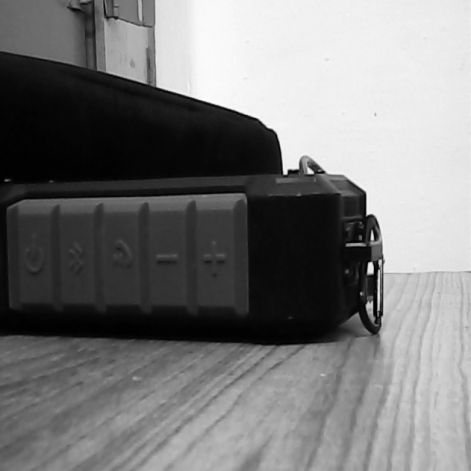
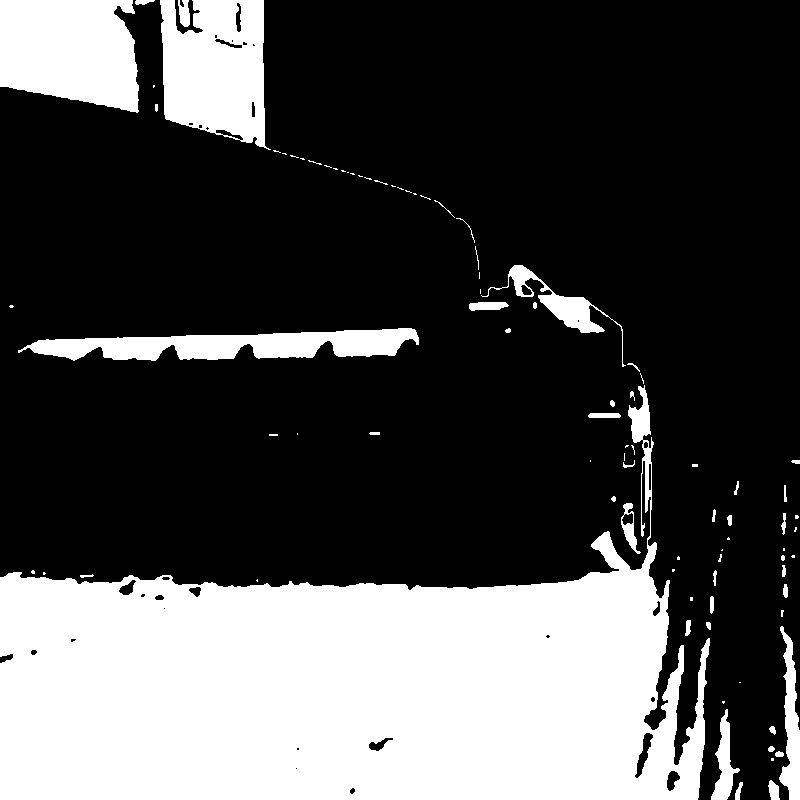
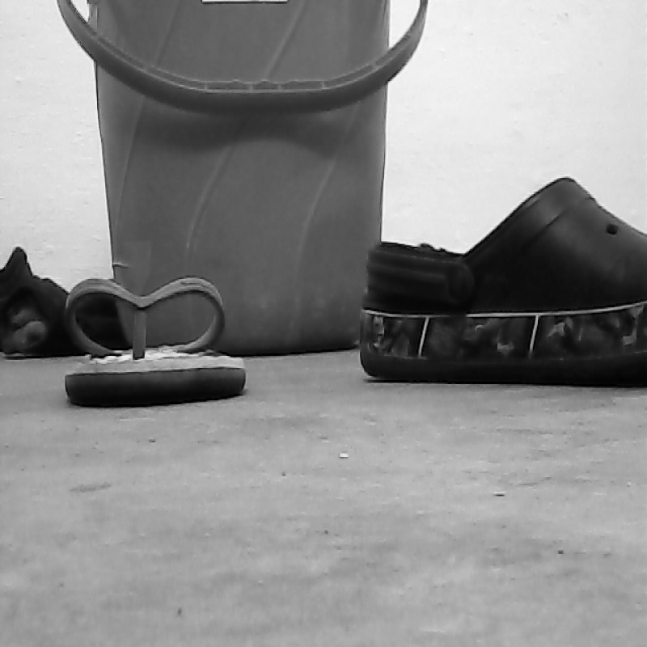
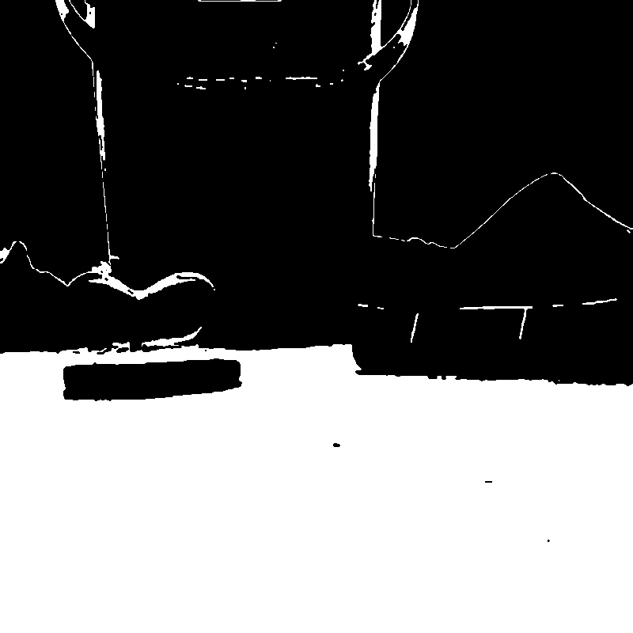

# Ground-Segregation
Using K-Means Clustering and openCV to segregate ground from video feed. 

### Output Result

I have shown two diffferent images. The images 800x800 in the example but they are 400x400 in the code by default. You can change it yourselves.

1st image (table top)

2nd image(ground)

The white pixels show ground in both the images.

### Description
cluster.py clusters the region into different segments.(using 3 in the code)
segregate.py  separates ground assuming the nearest 100 pixels for ground.
run.py uses the two files to run the final code and convert input frame into ground and non-ground objects.

### How to run the code
To run the code use :
 >> python run.py -size1 400 -size2 400 -strip_size 100 -cam 0 -k_value 3
 
 Above shows the default value in used in the program change accordingly for one's convenience.
 size1 and size2 -  dimensions of video feed
 strip_size      -  ground assumption
 cam             -  the cam used for taking in video
 k_value         -  no. of clusters

### Runtime Speed.
At 400x400 video feed the implementation ran with 17-18fps on my cpu.
Whereas at 800x800 it ran with about 2-3 fps.

